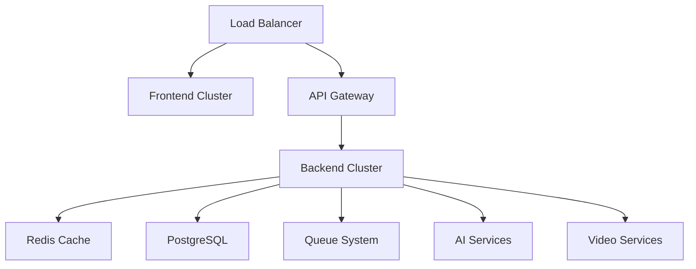

# Recipe Generator App - Scaling & Maintenance Guide

## 📋 Table of Contents

1. [Architecture Overview](#architecture-overview)
2. [Scaling Strategies](#scaling-strategies)
3. [Monitoring & Alerting](#monitoring--alerting)
4. [Performance Optimization](#performance-optimization)
5. [Cost Management](#cost-management)
6. [Maintenance Schedules](#maintenance-schedules)
7. [Troubleshooting Guide](#troubleshooting-guide)
8. [Security Best Practices](#security-best-practices)
9. [Disaster Recovery](#disaster-recovery)
10. [Team Runbooks](#team-runbooks)

---

## 🏗 Architecture Overview

### Current Stack
- **Backend**: NestJS + TypeScript + Prisma ORM
- **Frontend**: Next.js + React + Tailwind + React Query
- **Database**: PostgreSQL with connection pooling
- **Cache**: Redis for sessions and API responses
- **Queue**: Enhanced queue system with batching
- **Monitoring**: Winston logging + Prometheus metrics + Sentry
- **Infrastructure**: Docker + Kubernetes + Nginx

### Key Components


---

## 📈 Scaling Strategies

### Horizontal Scaling Triggers

#### Backend Scaling (Auto HPA)
```yaml
# Current thresholds in k8s/production-deployment.yaml
CPU: 70% average utilization
Memory: 80% average utilization
Min Replicas: 2
Max Replicas: 10
```

#### Manual Scaling Commands
```bash
# Scale backend pods
kubectl scale deployment recipe-backend --replicas=5 -n recipe-app

# Scale database connections
# Update DATABASE_CONNECTION_LIMIT in configmap
kubectl patch configmap recipe-config -n recipe-app -p '{"data":{"DB_CONNECTION_LIMIT":"40"}}'

# Restart deployment to pick up new config
kubectl rollout restart deployment/recipe-backend -n recipe-app
```

### Vertical Scaling

#### Database Scaling
```sql
-- Check current connections
SELECT count(*) FROM pg_stat_activity;

-- Monitor slow queries
SELECT query, mean_exec_time, calls 
FROM pg_stat_statements 
ORDER BY mean_exec_time DESC 
LIMIT 10;
```

#### Redis Scaling
```bash
# Check Redis memory usage
redis-cli info memory

# Scale Redis vertically
kubectl patch deployment redis -n recipe-app -p '{"spec":{"template":{"spec":{"containers":[{"name":"redis","resources":{"limits":{"memory":"512Mi"}}}]}}}}'
```

### Load Testing
```bash
# API load testing
hey -n 1000 -c 50 -H "Authorization: Bearer $JWT_TOKEN" https://api.recipeapp.com/api/recipes

# Frontend load testing
artillery quick --count 100 --num 10 https://recipeapp.com
```

---

## 📊 Monitoring & Alerting

### Key Metrics to Monitor

#### Application Metrics
- **Response Time**: < 2000ms (95th percentile)
- **Error Rate**: < 5%
- **Throughput**: Requests per second
- **AI Usage**: Tokens per hour/day
- **Video Generation**: Queue depth and processing time

#### Infrastructure Metrics
- **CPU Usage**: < 70% average
- **Memory Usage**: < 80% average
- **Disk Usage**: < 85%
- **Network I/O**: Bandwidth utilization
- **Database Connections**: Active vs. available

#### Business Metrics
- **Daily Active Users**: User engagement
- **Conversion Rate**: Free to paid subscriptions
- **Churn Rate**: Monthly subscription cancellations
- **Revenue**: Daily/Monthly recurring revenue
- **Cost Per User**: AI + infrastructure costs

### Alert Configuration

#### Critical Alerts (PagerDuty + SMS + Email + Slack)
- Server error rate > 5%
- Database connection failures
- Payment processing failures
- Monthly costs > $1000
- Security breaches

#### High Priority (Email + Slack)
- Response time > 2000ms
- Memory usage > 85%
- AI quota exceeded (monthly)
- High failed login attempts

#### Medium Priority (Slack)
- Daily cost threshold exceeded
- AI quota warning (90% of daily limit)
- Subscription expiration reminders

### Dashboard Setup

#### Grafana Dashboards
1. **System Overview**: CPU, memory, disk, network
2. **Application Performance**: Response times, error rates, throughput
3. **Business Metrics**: Users, revenue, conversions
4. **Cost Tracking**: Daily/monthly costs by service
5. **AI Usage**: Token consumption, model performance

---

## ⚡ Performance Optimization

### Backend Optimizations

#### Database Performance
```bash
# Run daily optimization
npm run maintenance:optimize-db

# Manual database optimization
psql $DATABASE_URL -c "VACUUM ANALYZE;"
psql $DATABASE_URL -c "REINDEX DATABASE recipe_db;"
```

#### Redis Performance
```bash
# Monitor Redis performance
redis-cli --latency-history

# Optimize Redis memory
redis-cli CONFIG SET maxmemory-policy allkeys-lru
redis-cli CONFIG SET maxmemory 256mb
```

#### Queue Optimization
```javascript
// Monitor queue performance
const stats = await queueService.getQueueStats();
console.log('Queue Stats:', stats);

// Adjust queue workers based on load
if (stats.ai_generation.pending > 100) {
  // Scale up AI workers
  await queueService.scaleWorkers('ai_generation', 8);
}
```

### Frontend Optimizations

#### Build Optimization
```bash
# Analyze bundle size
npm run build:analyze

# Check for unused dependencies
npm run build:unused

# Optimize images
npm run optimize:images
```

#### Performance Monitoring
```javascript
// Monitor Core Web Vitals
import { getCLS, getFID, getFCP, getLCP, getTTFB } from 'web-vitals';

getCLS(console.log);
getFID(console.log);
getFCP(console.log);
getLCP(console.log);
getTTFB(console.log);
```

---

## 💰 Cost Management

### Current Cost Structure
- **Compute**: $200-400/month (Kubernetes cluster)
- **Database**: $100-200/month (PostgreSQL + backups)
- **AI Services**: $300-1000/month (OpenAI/Claude usage)
- **Video Generation**: $100-500/month
- **Storage & CDN**: $50-100/month
- **Monitoring & Logs**: $50-100/month

### Cost Optimization Strategies

#### AI Cost Optimization
```javascript
// Use cheaper models for simple tasks
const model = complexity === 'simple' ? 'gpt-3.5-turbo' : 'gpt-4';

// Implement response caching
const cachedResponse = await redis.get(`ai_response:${hash(prompt)}`);
if (cachedResponse) return cachedResponse;

// Batch AI requests when possible
const results = await batchAIRequests(prompts);
```

#### Infrastructure Cost Optimization
```bash
# Use spot instances for non-critical workloads
kubectl patch deployment video-processor -p '{"spec":{"template":{"spec":{"nodeSelector":{"node-type":"spot"}}}}}'

# Schedule heavy tasks during off-peak hours
# Update cron jobs in maintenance.service.ts
```

### Cost Alerts & Budgets
```bash
# Set up AWS Budget alerts
aws budgets create-budget --account-id $ACCOUNT_ID --budget '{
  "BudgetName": "recipe-app-monthly",
  "BudgetLimit": {"Amount": "1000", "Unit": "USD"},
  "TimeUnit": "MONTHLY",
  "BudgetType": "COST"
}'
```

---

## 🔧 Maintenance Schedules

### Daily (Automated - 2:00 AM UTC)
- ✅ Clean up old logs (keep 30 days)
- ✅ Optimize database tables
- ✅ Clean up expired sessions
- ✅ Update cost analytics
- ✅ Clean up temporary files
- ✅ Archive old data (6+ months)

### Weekly (Automated - Sunday 3:00 AM UTC)
- ✅ Generate weekly reports
- ✅ Optimize database indices
- ✅ Clean up old analytics data
- ✅ Update system metrics
- ✅ Perform security audit
- ✅ Backup critical data

### Monthly (Automated - 1st 4:00 AM UTC)
- ✅ Generate monthly reports
- ✅ Archive old records (1+ years)
- ✅ Update subscription metrics
- ✅ Database vacuum and reindex
- ✅ Review cost optimizations
- ✅ Update system configuration

### Quarterly (Manual)
- [ ] Security penetration testing
- [ ] Disaster recovery testing
- [ ] Performance benchmarking
- [ ] Infrastructure cost review
- [ ] Technology stack updates
- [ ] Backup restoration testing

### Annual (Manual)
- [ ] Complete security audit
- [ ] Infrastructure architecture review
- [ ] Technology migration planning
- [ ] Cost optimization analysis
- [ ] Team training and documentation update

---

## 🚨 Troubleshooting Guide

### Common Issues & Solutions

#### High Response Times
```bash
# 1. Check system resources
kubectl top nodes
kubectl top pods -n recipe-app

# 2. Check database performance
psql $DATABASE_URL -c "SELECT * FROM pg_stat_activity WHERE state = 'active';"

# 3. Check Redis performance
redis-cli --latency

# 4. Scale up if needed
kubectl scale deployment recipe-backend --replicas=5 -n recipe-app
```

#### High Memory Usage
```bash
# 1. Identify memory-hungry pods
kubectl top pods -n recipe-app --sort-by=memory

# 2. Check for memory leaks in logs
kubectl logs -f deployment/recipe-backend -n recipe-app | grep -i memory

# 3. Restart pods if needed
kubectl rollout restart deployment/recipe-backend -n recipe-app
```

#### Database Connection Issues
```bash
# 1. Check connection pool
psql $DATABASE_URL -c "SELECT count(*) FROM pg_stat_activity;"

# 2. Check for long-running queries
psql $DATABASE_URL -c "SELECT pid, now() - pg_stat_activity.query_start AS duration, query FROM pg_stat_activity WHERE (now() - pg_stat_activity.query_start) > interval '5 minutes';"

# 3. Increase connection limit if needed
kubectl patch configmap recipe-config -n recipe-app -p '{"data":{"DB_CONNECTION_LIMIT":"30"}}'
```

#### Queue Backup
```bash
# 1. Check queue stats
curl -H "Authorization: Bearer $ADMIN_TOKEN" https://api.recipeapp.com/api/admin/queue/stats

# 2. Scale queue workers
curl -X POST -H "Authorization: Bearer $ADMIN_TOKEN" https://api.recipeapp.com/api/admin/queue/scale -d '{"queue":"ai_generation","workers":10}'

# 3. Clear stuck jobs if needed
curl -X POST -H "Authorization: Bearer $ADMIN_TOKEN" https://api.recipeapp.com/api/admin/queue/clear-failed
```

### Emergency Procedures

#### Complete Service Outage
1. **Check Infrastructure**: Kubernetes cluster, load balancer
2. **Check Dependencies**: Database, Redis, external APIs
3. **Enable Maintenance Mode**: Frontend displays maintenance page
4. **Scale Up Resources**: Increase replicas and resources
5. **Communicate**: Update status page, notify users
6. **Monitor Recovery**: Watch metrics and logs

#### Data Loss Emergency
1. **Stop All Writes**: Enable read-only mode
2. **Assess Damage**: Identify affected data
3. **Restore from Backup**: Latest clean backup
4. **Verify Restoration**: Data integrity checks
5. **Resume Operations**: Disable read-only mode
6. **Post-mortem**: Document and prevent recurrence

---

## 🔐 Security Best Practices

### Access Control
```bash
# Rotate secrets quarterly
kubectl create secret generic recipe-secrets-new \
  --from-literal=database-url=$NEW_DATABASE_URL \
  --from-literal=jwt-secret=$NEW_JWT_SECRET \
  --from-literal=openai-api-key=$NEW_OPENAI_KEY

# Update deployment to use new secrets
kubectl patch deployment recipe-backend -p '{"spec":{"template":{"spec":{"containers":[{"name":"backend","envFrom":[{"secretRef":{"name":"recipe-secrets-new"}}]}]}}}}'
```

### Network Security
```yaml
# Network policies are configured in k8s/production-deployment.yaml
# Regular security scans
trivy image recipe-app/backend:latest
```

### Data Protection
- All data encrypted in transit (TLS 1.3)
- Database encrypted at rest
- Secrets managed via Kubernetes secrets
- Regular security patches applied
- GDPR compliance for user data

---

## 🚑 Disaster Recovery

### Backup Strategy
```bash
# Database backups (automated)
pg_dump $DATABASE_URL | gzip > backup_$(date +%Y%m%d_%H%M%S).sql.gz
aws s3 cp backup_*.sql.gz s3://recipe-backups/database/

# Application backups
kubectl create backup recipe-backup --include-namespaces recipe-app
```

### Recovery Procedures

#### Database Recovery
```bash
# Restore from backup
gunzip -c backup_20231201_020000.sql.gz | psql $DATABASE_URL

# Verify data integrity
psql $DATABASE_URL -c "SELECT count(*) FROM users;"
```

#### Full System Recovery
1. **Provision Infrastructure**: Kubernetes cluster, networking
2. **Deploy Applications**: Use latest Docker images
3. **Restore Database**: From most recent backup
4. **Update DNS**: Point to new infrastructure
5. **Verify Functionality**: Run integration tests
6. **Monitor Closely**: Watch for issues

### Recovery Time Objectives (RTO)
- **Database**: < 4 hours
- **Application**: < 2 hours
- **Full System**: < 8 hours

### Recovery Point Objectives (RPO)
- **Database**: < 1 hour (hourly backups)
- **File Storage**: < 24 hours (daily sync)

---

## 👥 Team Runbooks

### On-Call Procedures

#### Alert Response Times
- **Critical**: 15 minutes
- **High**: 1 hour
- **Medium**: 4 hours
- **Low**: Next business day

#### Escalation Matrix
1. **Primary On-Call**: Initial response
2. **Secondary On-Call**: After 30 minutes
3. **Team Lead**: After 1 hour
4. **Engineering Manager**: After 2 hours

### Deployment Procedures

#### Production Deployment
```bash
# 1. Run tests
npm test
npm run test:e2e

# 2. Build and push image
docker build -t recipe-app/backend:v1.2.3 .
docker push recipe-app/backend:v1.2.3

# 3. Update Kubernetes deployment
kubectl set image deployment/recipe-backend backend=recipe-app/backend:v1.2.3 -n recipe-app

# 4. Monitor deployment
kubectl rollout status deployment/recipe-backend -n recipe-app

# 5. Run smoke tests
npm run test:smoke
```

#### Rollback Procedure
```bash
# Quick rollback
kubectl rollout undo deployment/recipe-backend -n recipe-app

# Rollback to specific revision
kubectl rollout undo deployment/recipe-backend --to-revision=2 -n recipe-app
```

### Communication Protocols

#### Status Page Updates
- **Investigating**: Initial issue detection
- **Identified**: Root cause found
- **Monitoring**: Fix deployed, monitoring
- **Resolved**: Issue fully resolved

#### Post-Incident Review
1. **Timeline**: Detailed chronology of events
2. **Root Cause**: Technical and process failures
3. **Impact**: Users affected, revenue impact
4. **Action Items**: Prevent recurrence
5. **Documentation**: Update runbooks

---

## 📈 Performance Baselines

### Response Time Targets
- **API Endpoints**: < 500ms (95th percentile)
- **Database Queries**: < 100ms (95th percentile)
- **AI Generation**: < 30s (95th percentile)
- **Video Generation**: < 2 minutes (95th percentile)

### Availability Targets
- **Overall System**: 99.9% (8.76 hours downtime/year)
- **API**: 99.95% (4.38 hours downtime/year)
- **Database**: 99.99% (52.6 minutes downtime/year)

### Capacity Planning
- **Users**: Current: 10K, Target: 100K users
- **Requests**: Current: 1M/day, Target: 10M/day
- **Storage**: Current: 100GB, Growth: 10GB/month

---

## 🔄 Continuous Improvement

### Monthly Reviews
- [ ] Performance metrics analysis
- [ ] Cost optimization opportunities
- [ ] Security posture assessment
- [ ] User feedback integration
- [ ] Technology stack evaluation

### Automation Goals
- [ ] Automated scaling based on business metrics
- [ ] Predictive maintenance alerts
- [ ] Automated cost optimization
- [ ] Self-healing infrastructure
- [ ] Automated security patching

---

## 📞 Emergency Contacts

### Internal Team
- **Engineering Lead**: engineering-lead@company.com
- **DevOps Lead**: devops-lead@company.com
- **On-Call**: oncall@company.com

### External Providers
- **AWS Support**: Case management console
- **OpenAI Support**: support@openai.com
- **Database Provider**: support@neon.tech

### Monitoring Services
- **PagerDuty**: https://company.pagerduty.com
- **Sentry**: https://company.sentry.io
- **Grafana**: https://company.grafana.net

---

*Last Updated: 2024-01-20*
*Next Review: 2024-04-20*

**Remember**: This guide should be updated regularly as the system evolves. Always test procedures in staging before applying to production.
